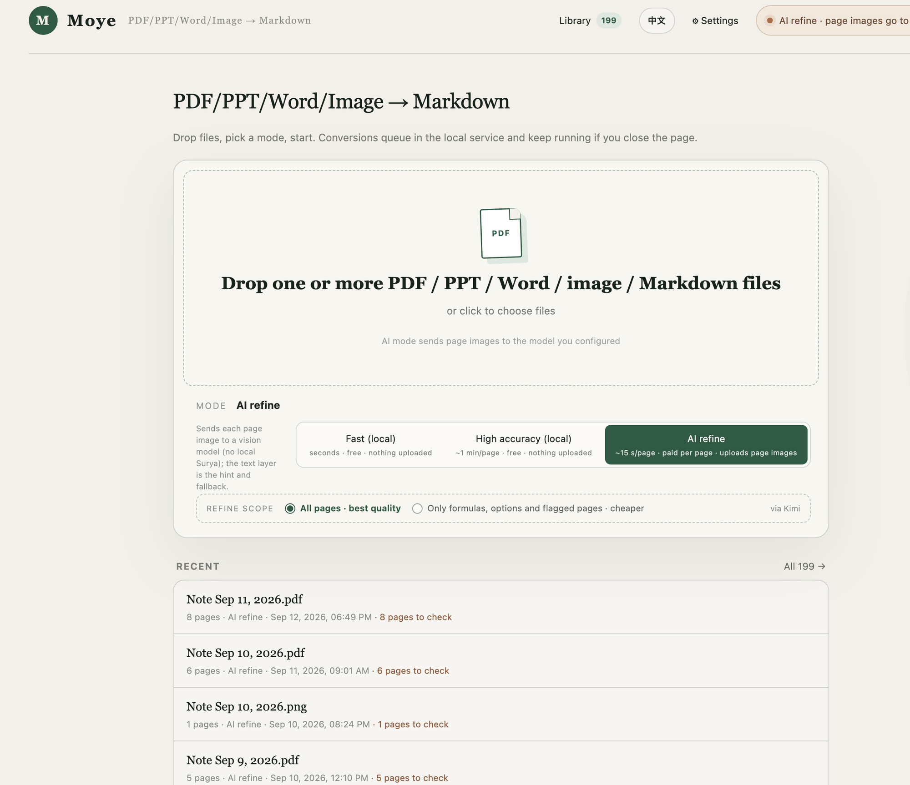

# Moye (墨页) — PDF/PPT/Word/image → Markdown that survives scanned pages, math, and 700-page books

Most "PDF to Markdown" tools read the PDF's text layer and stop there. That works on a clean
export from Word and falls apart on everything you actually need converted: scanned textbooks,
exam papers full of formulas, tables, slides. Moye is a local tool that runs on your Mac and
picks the right engine per document — text layer for the easy ones, [Surya](https://github.com/VikParuchuri/surya)
layout/OCR for the hard ones, and optionally a vision model to proofread each page against its image.

[中文说明 / Chinese README](./README.zh.md)



## What it does that text-layer converters don't

|                                        | Text-layer tools (`pdf2md`, etc.) | Moye |
| -------------------------------------- | :---: | :---: |
| Clean digital PDFs                     | ✓ | ✓ |
| Scanned pages / photos of paper        | ✗ | ✓ Surya OCR |
| Math → LaTeX (`$…$`, `$$…$$`)          | ✗ | ✓ |
| Tables → Markdown tables               | luck | ✓ layout-aware |
| Reading order on multi-column pages    | ✗ | ✓ |
| PowerPoint (.ppt/.pptx)                | ✗ | ✓ via LibreOffice |
| Word (.doc/.docx)                      | ✗ | ✓ via LibreOffice |
| Images (png/jpg/webp/heic/multi-page tiff) | ✗ | ✓ wrapped into a PDF, pixel-exact |
| "This image has no text in it"         | silent empty output | ✓ the model says so, per page |
| 700-page, 400 MB book                  | browser dies (~10 MB limit) | ✓ tested |
| Close the tab mid-conversion           | job lost | job keeps running on the server |
| Per-page quality report                | ✗ | ✓ which pages to double-check, and why |
| Vision-model refinement with validation | ✗ | ✓ Gemini / Kimi / Qwen / OpenRouter, auto-fallback |

## Three modes

- **Fast** — reads the PDF text layer only. Instant, nothing leaves your machine, flags pages that look scanned.
- **High accuracy (local)** — runs Surya on every page for layout, tables and formulas. Slower, still 100% local.
- **AI refine** — renders each page to an image and has a vision model transcribe it, using the text layer
  as a hint and fallback. Every model result is **validated** (length, formula count, answer-choice labels);
  anything that fails validation falls back to the local draft instead of silently shipping garbage.
  Only in this mode do page images leave your machine, and only to the provider you configured.
  When a page genuinely holds no text (a photo, an illustration, a blank page), the model reports
  `noText` and the page is marked *AI detection: no extractable text* — instead of being logged as a
  failed recognition, which is what an empty answer used to look like.

Images (png/jpg/jpeg/webp/bmp/gif/tiff/heic) are accepted too: they are wrapped into a PDF first and then
run through the same pipeline. The wrapping is lossless for the AI path — the page is sized so that the
renderer's `scale=2` reproduces the original pixels exactly — a multi-page TIFF becomes a multi-page PDF,
HEIC goes through macOS `sips`, and anything longer than 4000 px is downscaled to that. Note that **Fast
mode reads a text layer, which an image does not have** — use Balanced or AI refine for images.

## Quick start (macOS)

Requirements: Node ≥ 22.13, Python 3.12 with [Surya](https://github.com/VikParuchuri/surya) in a venv at
`../.venv-marker` (sibling of the repo — the service looks for `../.venv-marker/bin/surya_ocr`),
optionally LibreOffice for PPT/Word. Image support uses Pillow (already a Surya dependency) and, for HEIC, the built-in `sips`.

```bash
git clone https://github.com/xyzxinlu-max/moye-pdf-to-markdown
cd moye-pdf-to-markdown
npm install

# Surya (local OCR) — tested with surya-ocr 0.22 + pypdfium2 5.10 on Python 3.12.
# With uv:
uv venv ../.venv-marker --python 3.12
uv pip install --python ../.venv-marker/bin/python surya-ocr pypdfium2
# or with plain venv + pip:
#   python3.12 -m venv ../.venv-marker && ../.venv-marker/bin/pip install surya-ocr pypdfium2
# First run downloads the Surya models (a few GB).

# optional: PPT/PPTX/Word (.doc/.docx) support
brew install --cask libreoffice

# build + register two launchd services (web on :3000, conversion service on :8765)
./安装开机自启.command
```

Then open <http://localhost:3000>. The services start on login and restart if they crash;
`./启动全部服务.command` brings them up manually. Logs are in `logs/`.

For AI refine, open **Settings** in the UI and paste an API key for Gemini, Kimi (Moonshot),
Qwen (DashScope) or OpenRouter. Keys are stored in `settings.local.json` (mode 0600, gitignored)
and never sent to the browser in clear text.

## How it works

```
browser (:3000)  ──submit / watch progress (SSE)──▶  local service (:8765)  ──▶  Surya / vision models
React, no logic                                       queue · pipeline · SQLite
```

- **The browser is only a viewer.** Every conversion runs in the service; closing the tab changes nothing.
- **Jobs are persistent.** State in `data/moye.db` (SQLite), artifacts in `data/jobs/<id>/`.
  Long AI jobs checkpoint every page to `pages.jsonl`; a restart resumes from the last page instead of starting over.
- **Big documents are streamed, not loaded.** Pages are rendered in chunks of 48 as the model consumes them,
  and text-layer extraction runs in a short-lived subprocess so pdf.js's multi-GB heap for a large book
  never lands in the long-running service. A 698-page / 428 MB textbook peaks at ~0.8 GB RSS.
- **Concurrency is measured, not guessed.** An AIMD pacer (like TCP congestion control) keeps one lane per
  provider, ramps up on success, backs off on timeouts, and routes each page to the lane with the most free
  slots — so when one provider degrades, traffic drains to the others without configuration.
- **Three layers of fallback** for AI mode: switch upstream provider → switch model → fall back to the
  local draft. Every failure path is logged with its reason.

Code map: `local-ocr-server.mjs` (HTTP + provider calls) · `server/queue.mjs` (per-mode lanes, SSE) ·
`server/convert.mjs` (pipeline, validation, gates) · `server/pacer.mjs` (adaptive throttle) ·
`server/jobstore.mjs` (SQLite + checkpoints) · `app/page.tsx` (the entire UI).

## Output

- Markdown preview, copy, download; batch drops become a "collection" you can download as one `.md` or a `.zip`.
- Side-by-side view of the model's final text vs. the local draft, per page.
- A per-page quality list: which engine produced it, formula/option counts, and every reason a page was
  flagged for review. Exportable as JSON.
- A Library of everything you've converted, searchable, with the original PDF viewable in place.

## Tuning

All defaults were set by measurement on real batches (see comments in the code before changing them).

| Variable | Default | Meaning |
| --- | --- | --- |
| `MOYE_AI_JOB_CONCURRENCY` | 1 | documents converted at once in AI mode (the real ceiling is the global request gate) |
| `MOYE_AI_PAGE_CONCURRENCY` | per-provider weights | override the global in-flight request cap |
| `MOYE_RENDER_CHUNK_PAGES` | 48 | pages rendered per Python call in AI mode |
| `MOYE_PAGE_TIMEOUT_MS` | 30000 | single model call timeout (per-provider overrides exist) |
| `MOYE_OPENROUTER_PROVIDERS` | CoreWeave,Parasail,Inceptron,Baidu,Cloudflare | upstream allowlist — unpinned OpenRouter routing measured 20× slower |
| `MOYE_RENDER_CONCURRENCY` | 16 | concurrent Python render processes |

Live diagnostics: `curl -s http://127.0.0.1:8765/api/debug | python3 -m json.tool`.

## Development

```bash
npm run dev      # web app (don't run alongside the launchd web service on :3000)
npm run build    # then: launchctl kickstart -k gui/$(id -u)/com.kapozux.moye-web
npm test         # build + render tests
npm run lint
```

## Privacy

Fast and High-accuracy modes never make a network request with your document. AI refine sends page
images and the text-layer hint to the provider you chose, nothing else. Nothing is uploaded to us — there is no "us".

## License

MIT
