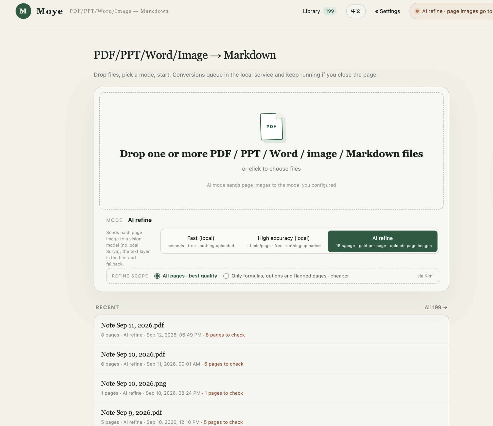

# 墨页 · PDF 转 Markdown

一个在本机浏览器中运行、并支持可选视觉模型精校的 PDF 转 Markdown 工具。默认模式不上传文件；只有启用 AI 精校时，选定页面才会发送给你配置的模型服务。



## 安装

全新的 Mac 上一条命令（不需要 Homebrew、不需要管理员密码、不需要事先装 Python 或 Node）：

```bash
curl -fsSL https://raw.githubusercontent.com/Kapozux/_pdf-dealer_Moye/main/install.sh | zsh
```

已经下载了项目的话，双击 `一键安装.command`（第一次要右键 → 打开），或在终端运行 `./install.sh`。

安装脚本把 Node 和 Python 装在**项目文件夹里**（`.runtime/`、`.venv/`），装好必需的部分，可选组件逐个询问，
最后注册两个开机自启服务（网页 3000、识别服务 8765）并打开 <http://localhost:3000>。可以重复运行，装过的步骤会跳过。

| 组件 | 用途 | 大小 |
|---|---|---|
| Node + npm 依赖 | 全部 | 必需 |
| Python + pypdfium2 + Pillow | AI 精校（渲染页面）、图片 | 必需，约 60MB |
| **Ollama + 视觉模型** | **不用 API Key** 的 AI 精校，页面不上传 | 3～6GB，会询问（默认装） |
| Surya + llama.cpp | 本地高精度模式 | 约 2GB，会询问；llama.cpp 需要 Homebrew |
| LibreOffice | PPT / Word | 约 700MB，会询问 |
| chrome-headless-shell | 下载 PDF、.md 转 PDF | 约 100MB |

跳过的组件随时可以在网页 **设置 → 环境** 里一键补装：那里列出缺什么、影响什么，按钮背后调用的是同一个
`install.sh --only <组件>`，输出记在 `logs/setup.log`。`./uninstall.sh` 撤掉开机自启；删掉项目文件夹就全部清空。

服务装好以后登录 macOS 会自动启动，异常退出会自动恢复。网页没打开时双击 `启动全部服务.command`
（旧的 `start.command` 也转到这里）。日志在 `logs/`。开发时仍可用 `npm run dev`，但别和后台网页服务同时占 3000 端口。

## 三种模式

- **本地快速**：只读取 PDF 自带的文字层，速度最快；扫描页会标记出来。
- **本地高精度**：整份 PDF 使用本机 Surya 识别版面、表格与公式，并将数学内容保存为 LaTeX。
- **AI 精校**：把页面图像交给视觉模型识别，文字层作提示与回退。模型可以是本机 Ollama（免费、不上传，比云端慢得多、一次只跑一页；速度还没实测过），也可以是 Gemini、Kimi、Qwen 百炼或 OpenRouter；模型结果未通过长度、公式数和选项标签校验时自动回退。

## 输出

- 可预览、复制或下载 Markdown。
- 可一次选择或拖入多份 PDF；队列逐份处理，单份失败不会中断其他文件，成功结果自动进入 Library，并可下载单份或合并 Markdown。
- 可对照浏览原始 PDF。
- 显示逐页处理方法、实际模型、公式数量与待核对原因。
- 可对照 AI 最终稿和 Surya 本地初稿，并下载完整 JSON 质量报告。
- 转换完成后自动存入 Library；可搜索历史、重新打开、查看原 PDF 或删除。

Library 保存在本机识别服务这一侧：任务状态在 `data/moye.db`（SQLite），原始 PDF、完整结果 JSON 与导出的 Markdown 在 `data/jobs/<任务id>/`。转换在服务端排队执行，关掉网页任务照跑，重开页面还能接着看进度；服务重启后未完成的任务会从逐页存档续跑。清除浏览器数据不影响 Library，本机任何浏览器打开都能看到同一份。重新精校会原地覆盖同一条记录，覆盖前留一份 `result.prev.json` / `document.prev.md` 备份，需要时可手动改回。

首次使用 Surya 时会加载本机模型。本地高精度与 AI 精校必须通过上述服务入口启动，确保网页和本机识别服务同时运行。

AI 精校的供应商、模型、精校范围和 API Key 在网页右上角“设置”中配置。选「本机 Ollama」不需要 Key，本机推荐模型按内存选：16GB 及以上 `qwen3-vl:8b-instruct`，以下 `qwen3-vl:4b-instruct`，可在“设置 → 环境”里一键下载。Ollama 官方模型库在国内网络上常常下不动（文件放在 Cloudflare 上），安装脚本和“环境”页会同时测官方源和魔搭镜像（同一个模型）的速度，自动用快的那个；`MOYE_MODEL_SOURCE=ollama|modelscope` 可以强制指定。设置页提供常用模型预设，也允许直接填写新的 Model ID。Key 保存在项目目录的 `settings.local.json`（已加入 `.gitignore`，权限为仅当前用户可读写），不会写入 Library。不要把这个文件提交或分享给他人。

原生模型建议：Kimi 图片识别使用 `kimi-k2.6`；Qwen 稳定首选 `qwen3.7-plus`，Token Plan 可尝试 `qwen3.8-max-preview`，低成本可用 `qwen3.7-flash`，文档/表格/试卷/手写提取可用 `qwen-vl-ocr`。设置页也能在填入 Key 后从服务商实时同步可用视觉模型，避免内置列表过时。阿里云百炼 Key 与 API Base URL 的地域必须一致。

## 构建检查

```bash
npm run build
```
